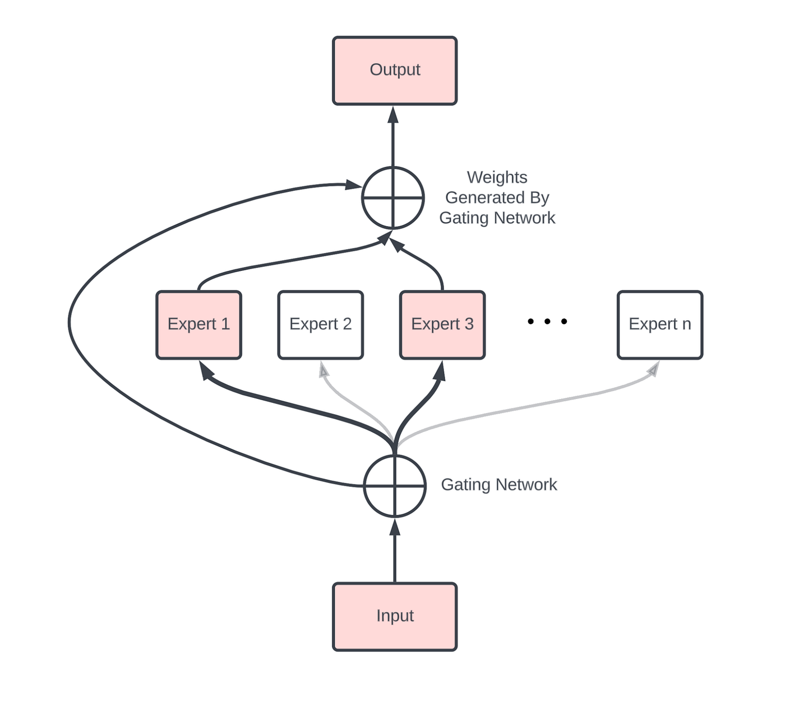
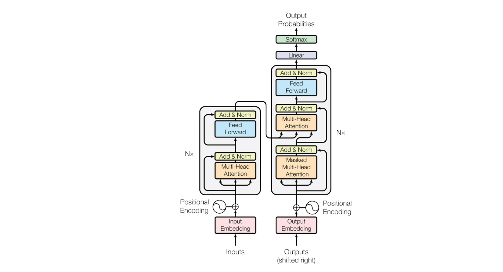

<div style="max-width: 820px; margin: 0 auto; padding: 24px 24px;">
Common

#### Q1. What is tokenization, and why is it important in LLMs?
Tokenization is the process of splitting text into smaller units called **tokens**, which can be words, subwords, or even characters. This step is crucial because LLMs do not understand raw text directly — they process sequences of numbers representing these tokens.

Effective tokenization allows models to:
- Handle various languages and scripts
- Manage rare or out-of-vocabulary words
- Reduce vocabulary size, improving both efficiency and performance

---

#### Q2. What is LoRA and QLoRA?
LoRA and QLoRA are techniques designed to optimize the fine-tuning of Large Language Models (LLMs), focusing on reducing memory usage and enhancing efficiency without compromising performance in Natural Language Processing (NLP) tasks.

**LoRA** is a parameter-efficient fine-tuning method that introduces new trainable parameters to modify a model's behavior without increasing its overall size. By doing so, LoRA maintains the original parameter count, reducing the memory overhead typically associated with training large models. It works by adding low-rank matrix adaptations to the model's existing layers, allowing for significant performance improvements while keeping resource consumption in check.

**QLoRA** builds on LoRA by incorporating quantization to further optimize memory usage. It uses techniques such as 4-bit Normal Float, Double Quantization, and Paged Optimizers to compress the model's parameters and improve computational efficiency. This method is particularly useful when scaling large models, as it maintains performance levels comparable to full-precision models while significantly reducing resource consumption.

---

#### Q3. Explain the concept of temperature in LLM text generation.
Temperature is a hyperparameter that controls the randomness of text generation by adjusting the probability distribution over possible next tokens. 

A low temperature (close to 0) makes the model highly deterministic, favoring the most probable tokens. Conversely, a high temperature (above 1) encourages more diversity by flattening the distribution, allowing less probable tokens to be selected. For instance, a temperature of 0.7 strikes a balance between creativity and coherence, making it suitable for generating diverse but sensible outputs.

---

#### Q4. What is masked language modeling, and how does it contribute to model pretraining?

Masked language modeling (MLM) is a training objective where some tokens in the input are randomly masked, and the model is tasked with predicting them based on context. This forces the model to learn contextual relationships between words, enhancing its ability to understand language semantics. MLM is commonly used in models like BERT, which are pretrained using this objective to develop a deep understanding of language before fine-tuning on specific tasks.

| Pros                                   | Cons                          |
|-----------------------------------------|-------------------------------|
| Enhances contextual understanding      | Requires large amount of data |
| Improves language semantics            | Computationally expensive     |
| Pretraining for fine-tuning            | Potential for overfitting     |
| Widely used in BERT                    | Masking randomness           |

---

#### Q5. What are Sequence-to-Sequence Models?
Sequence-to-Sequence (Seq2Seq) Models are a type of neural network architecture designed to transform one sequence of data into another sequence. These models are commonly used in tasks where the input and output have variable lengths, such as in machine translation, text summarization, and speech recognition.

---

#### Q6. How do autoregressive models differ from masked models in LLM training?
Autoregressive models, such as GPT, generate text one token at a time, with each token predicted based on the previously generated tokens. This sequential approach is ideal for tasks like text generation. Masked models, like BERT, predict randomly masked tokens within a sentence, leveraging both left and right context. Autoregressive models excel in generative tasks, while masked models are better suited for understanding and classification tasks.

---
#### Q7. What role do embeddings play in LLMs, and how are they initialized?
Embeddings are vector representations of tokens that capture their semantic meaning. In LLMs, embeddings are used to convert tokens into continuous vectors that can be processed by the model. They are initialized using techniques like random initialization or pre-training on large corpora.

---

#### Q8. Explain the difference between top-k sampling and nucleus (top-p) sampling in LLMs.
Top-k token sampling: We sample the next token among the k tokens with the highest predicted probabilities.

Top-p sampling: We sample among top predicted words with an associated cumulative probability of at least p.

---

#### Q9. How does prompt engineering influence the output of LLMs?
Prompt engineering involves crafting input prompts to guide an LLM’s output effectively. Since LLMs are highly sensitive to input phrasing, a well-designed prompt can significantly influence the quality and relevance of the response. For example, adding context or specific instructions within the prompt can improve accuracy in tasks like summarization or question-answering. Prompt engineering is especially useful in zero-shot and few-shot learning scenarios, where task-specific examples are minimal.

---

#### Q10. What is model distillation, and how is it applied to LLMs?
Model distillation is a technique where a smaller, simpler model (student) is trained to replicate the behavior of a larger, more complex model (teacher). In the context of LLMs, the student model learns from the teacher’s soft predictions rather than hard labels, capturing nuanced knowledge. This approach reduces computational requirements and memory usage while maintaining similar performance, making it ideal for deploying LLMs on resource-constrained devices.

---

#### Q11. How do LLMs handle out-of-vocabulary (OOV) words?
Out-of-vocabulary words refer to words that the model did not encounter during training. LLMs address this issue through subword tokenization techniques like Byte-Pair Encoding (BPE) and WordPiece. These methods break down OOV words into smaller, known subword units. 

---

#### Q12. How does the Transformer architecture overcome the challenges faced by traditional Sequence-to-Sequence models?
The Transformer architecture overcomes key limitations of traditional Seq2Seq models in several ways:
- **Parallel Processing**: Seq2Seq models process sequentially, slowing training. Transformers use self-attention to process tokens in parallel, speeding up both training and inference.
- **Attention Mechanism**: Seq2Seq models struggle with long-range dependencies. Transformers use self-attention mechanisms to capture long-range dependencies, allowing them to process information across the entire input sequence.
- **Positional Encoding**: Since Transformers process the entire sequence at once, positional encoding is used to ensure the model understands token order.
- **Context Bottleneck**: Seq2Seq uses a single context vector, limiting information flow. Transformers let the decoder attend to all encoder outputs, improving context retention. 

---

#### Q13. What is overfitting in machine learning, and how can it be prevented?
Overfitting occurs when a machine learning model performs well on the training data but poorly on unseen or test data. This typically happens because the model has learned not only the underlying patterns in the data but also the noise and outliers, making it overly complex and tailored to the training set. As a result, the model fails to generalize to new data.

**Techniques to overcome overfitting:**
- **Regularization (L1, L2)**: Adding a penalty to the loss function to discourage overly complex models. L1 (Lasso) can help in feature selection, while L2 (Ridge) smooths weights.
- **Dropout**: In neural networks, dropout randomly deactivates a fraction of neurons during training, preventing the model from becoming overly reliant on specific nodes.
- **Data Augmentation**: Creating new training examples by applying transformations like rotations, translations, or scaling to the original data.
- **Early Stopping**: Monitoring the performance of the model on validation data and stopping training when the validation loss stops decreasing.
- **Simpler Models**: Reducing the complexity of the model by decreasing the number of features, parameters, or layers can help avoid overfitting.

---

#### Q14. What are positional encodings in the context of large language models?
Positional encodings are a technique used to add information about the position of tokens in a sequence to the input embeddings. This is important because the Transformer architecture does not inherently understand the order of tokens in a sequence, so positional encodings are used to provide this information.

Mechanism:
- Additive Approach: Positional encodings are added to input word embeddings, merging static word representations with positional data.
- Sinusoidal Function: Many LLMs, such as the GPT series, use sinusoidal functions to generate these positional encodings.
  
Formula:
```
PE(pos, 2i) = sin(pos / (10000^(2i/d_model)))
PE(pos, 2i+1) = cos(pos / (10000^(2i/d_model)))

Where:
- pos is the position in the sequence
- i is the dimension index (0 ≤ i < d_model/2)
- d_model is the dimensionality of the model
```

---

#### Q15. What is Multi-head attention?
Multi-head attention is an enhancement of single-head attention, allowing a model to attend to information from different representation subspaces simultaneously, focusing on various positions in the data. Instead of using a single attention mechanism, multi-head attention projects the queries, keys, and values into multiple subspaces (denoted as h times) through distinct learned linear transformations.


This process involves applying the attention function in parallel to each of these projected versions of the queries, keys, and values, which generates multiple output vectors. These outputs are then combined to produce the final dv-dimensional result. This approach improves the model's ability to capture more complex patterns and relationships in the data.

**Multi-head attention:**
$$
MultiHead(Q, K, V) = Concat(head_1, ..., head_h)W^O$$

Where:
- $head_i = Attention(QW^Q_i, KW^K_i, VW^V_i)$
- $W^Q_i, W^K_i, W^V_i$ are the learned linear transformations for the i-th head
- $W^O$ is the learned linear transformation for the output


#### Q16. Derive the softmax function and explain its role in attention mechanisms.
The softmax function transforms a vector of real numbers into a probability distribution. For an input vector $x = [x_1, x_2, ..., x_n]$, the softmax function for the i-th element is defined as:
$$
Softmax(x_i) = \frac{exp(x_i)}{\sum_{j=1}^{n} exp(x_j)}
$$

- This ensures all output values lie between 0 and 1 and sum to 1, making them interpretable as probabilities. 
- In attention mechanisms, softmax is applied to the attention scores to normalize them, allowing the model to assign varying levels of importance to different tokens when generating output. This helps the model focus on the most relevant parts of the input sequence.

---

#### Q17. How is the dot product used in self-attention, and what are its implications for computational efficiency?
In self-attention, the dot product is used to calculate the similarity between query (Q) and key (K) vectors. The attention scores are computed as:

The dot product is defined as:
$$
Attention(Q, K, V) = softmax(\frac{QK^T}{\sqrt{d_k}})V
$$

Where:
- Q is the query matrix
- K is the key matrix
- V is the value matrix
- d_k is the dimensionality of the key matrix

The dot product measures alignment between tokens, helping the model decide
which tokens to focus on. While effective, the complexity of the dot product
in sequence length ($O(n^2)$) can be a challenge for long sequences, prompting the development of more efficient approximations.

---

#### Q18. Explain cross-entropy loss and why it is commonly used in language modeling.
Cross-entropy loss measures the difference between the predicted probability distribution and the true distribution (one-hot encoding of the correct token). It is defined as:
$$
CrossEntropy(y, \hat{y}) = -\sum_{i=1}^{n} y_i \log(\hat{y_i})
$$
Where:
- y is the true distribution
- $\hat{y}$ is the predicted distribution
- n is the number of tokens

Cross-entropy loss penalizes incorrect predictions more heavily, encouraging the model to output probabilities that are closer to 1 for the correct class. In language modeling, it ensures the model predicts the correct token in a sequence with high confidence.

---

#### Q19. How do you compute the gradient of the loss function with respect to embeddings?
To compute the gradient of the loss $L$ with respect to an embedding vector $E$, you apply the chain rule:
$$
\frac{\partial L}{\partial E} = \frac{\partial L}{\partial \hat{y}} \frac{\partial \hat{y}}{\partial E} 
$$
Here, $\frac{\partial L}{\partial \hat{y}}$ is the gradient of the loss with respect to the output logits, and $\frac{\partial \hat{y}}{\partial E}$ is the gradient of the logits with respect to the embeddings.

Backpropagation propagates these gradients through the network layers, adjusting the embedding vectors to minimize the loss.

---

#### Q20. What is the role of the Jacobian matrix in backpropagation through a transformer model?
The Jacobian matrix represents the partial derivatives of a vector-valued function with respect to its inputs. In backpropagation, it captures how each element of the output vector changes with respect to each input. For transformer models, the Jacobian is essential in computing gradients for multi-dimensional outputs, ensuring that each parameter (including weights and embeddings) is updated correctly to minimize the loss function.

Let $f: R^n -> R^m$ be a vector-valued function, then the Jacobian matrix is:
$$
f(x) = \begin{bmatrix}
f_1(x_1, x_2, ..., x_n) \\
f_2(x_1, x_2, ..., x_n) \\
\vdots \\
f_m(x_1, x_2, ..., x_n)
\end{bmatrix}
$$

where $x = [x_1, x_2, ..., x_n]$ is the input vector.
$$
J = \begin{bmatrix}
\frac{\partial f_1}{\partial x_1} & \frac{\partial f_1}{\partial x_2} & \cdots & \frac{\partial f_1}{\partial x_n} \\
\frac{\partial f_2}{\partial x_1} & \frac{\partial f_2}{\partial x_2} & \cdots & \frac{\partial f_2}{\partial x_n} \\
\vdots & \vdots & \ddots & \vdots \\
\frac{\partial f_m}{\partial x_1} & \frac{\partial f_m}{\partial x_2} & \cdots & \frac{\partial f_m}{\partial x_n}
\end{bmatrix}
$$
where $J$ is the Jacobian matrix.

#### Q21. Explain the concept of eigenvalues and eigenvectors in the context of matrix factorization for dimensionality reduction.
Eigenvalues and eigenvectors are fundamental in understanding the structure of matrices. Given a matrix $A$, an eigenvector $v$ and eigenvalue $\lambda$ satisfy the equation:
$$
Av = \lambda v
$$

In dimensionality reduction techniques like PCA (Principal Component Analysis), eigenvectors represent the principal components, and eigenvalues indicate the amount of variance captured by each component. Selecting components with the largest eigenvalues helps reduce dimensionality while preserving most of the data's variance.

---

#### Q22. How is the KL divergence used in evaluating LLM outputs?
KL (Kullback-Leibler) divergence measures the difference between two probability distributions P (true distribution) and Q (predicted distribution):
$$
KL(P || Q) = \sum_{i=1}^{n} P(i) \log(\frac{P(i)}{Q(i)})
$$

In LLMs, it quantifies how much the predicted distribution deviates from the target distribution. A lower KL divergence indicates that the model’s predictions closely match the true labels, making it a useful metric in evaluating and fine-tuning language models.

#### Q23. Derive the formula for the derivative of the ReLU activation function and discuss its significance.
The ReLU activation function is defined as:
$$
ReLU(x) = max(0, x)
$$

The derivative of the ReLU function is:
$$
\frac{d}{dx} ReLU(x) = \begin{cases} 1 & \text{if } x > 0 \\ 0 & \text{if } x \leq 0 \end{cases}
$$

ReLU introduces non-linearity while maintaining computational efficiency. Its sparsity (outputting zero for negative inputs) helps mitigate the **vanishing gradient problem**, making it a popular choice in deep learning models, including LLMs.

---

#### Q24. What is the chain rule in calculus, and how does it apply to gradient descent in deep learning?
The chain rule states that the derivative of a composite function is:
$$
\frac{d}{dx} f(g(x)) = f'(g(x))g'(x)
$$

In deep learning, the chain rule is used in backpropagation to compute gradients of the loss function with respect to each parameter layer by layer. This allows gradient descent to update weights efficiently propagating error signals backward through the network.

---

#### Q25. How do you compute the attention scores in a transformer, andwhat is their mathematical interpretation?
The attention scores in a transformer are computed as:
$$
Attention(Q, K, V) = softmax(\frac{QK^T}{\sqrt{d_k}})V
$$

Here, Q (queries), K (keys), and V (values) are learned representations of the input. The dot product $QK^T$ measures the similarity between queries and keys. Scaling by $\sqrt{d_k}$ prevents excessively large values, ensuring stable gradients. The softmax function normalizes these scores, emphasizing the most relevant tokens for each query, guiding the model’s focus during generation.

---

#### Q26. In what ways does Gemini’s architecture optimize training efficiency and stability compared to other multimodal LLMs like GPT-4?
Gemini’s architecture optimizes training efficiency and stability compared to other multimodal LLMs like GPT-4 in several ways:
- **Unified Multimodal Design**: Gemini integrates text and image processing in a single model, improving parameter sharing and reducing complexity
- **Cross-Modality Attention**: Enhanced interactions between text and images lead to better learning and stability during training.
- **Data-Efficient Pretraining**: Self-supervised and contrastive learning allow Gemini to train with less labeled data, boosting efficiency.
- **Balanced Objectives**: Better synchronization of text and image losses ensures stable training and smoother convergence.

---

#### Q27. What are the key steps involved in the Retrieval-Augmented Generation (RAG) pipeline?
1. **Retrieval**: The query is encoded and compared with precomputed document embeddings to retrieve relevant documents.
2. **Ranking**: The retrieved documents are ranked based on their relevance to the query.
3. **Generation**: The top-ranked documents are used as context by the LLM to generate more informed and accurate responses.

This hybrid approach enhances the model’s ability to produce context-aware outputs by incorporating external knowledge during generation.

---

#### Q28. How does the Mixture of Experts (MoE) technique improve LLM scalability?
Mixture of Experts (MoE) improves LLM scalability by using a gating function to activate only a subset of expert models (sub-networks) for each input, rather than the entire model.


This selective activation:
- **Reduces computational load**: Only a few experts are active per query, minimizing resource usage.
- **Maintains high performance**: The model dynamically selects the most relevant experts for each input, ensuring task complexity is handled effectively.

MoE enables efficient scaling of LLMs, allowing larger models with billions of parameters while controlling computational costs.

---

#### Q29. What is Chain-of-Thought (CoT) prompting, and how does it improve complex reasoning in LLMs?
Chain-of-Thought (CoT) prompting helps LLMs handle complex reasoning by encouraging them to break down tasks into smaller sequential steps. This improves their performance by:
- **Simulating human-like reasoning**: CoT prompts the model to approach problems step-by-step, similar to how humans solve complex issues.
- **Improving accuracy**: By guiding the model through a structured thought process, CoT reduces errors and improves performance on intricate queries.
- **Enhancing multi-step task performance**: It's particularly effective for tasks involving logical reasoning or multi-step calculations.

CoT improves LLMs' interpretability and reliability in tasks that require deeper reasoning and decision-making.

---

#### Q30. What is zero-shot learning, and how does it apply to LLMs?
Zero-shot learning enables LLMs to perform tasks they haven't been explicitly trained for by leveraging their broad understanding of language and general concepts. Instead of needing task-specific finetuning, the model can generate relevant outputs based on the instructions provided in the prompt.

For example:
- **Text classification**: The model can categorize text without specific training, simply by understanding the prompt's context.
- **Translation or summarization**: LLMs can translate or summarize text using provided instructions, even without task-specific finetuning.

This shows the LLMs' ability to generalize across tasks, making them versatile for various applications.

---

#### Q31. What is the vanishing gradient problem, and how does the Transformer architecture address it?
The vanishing gradient problem occurs when gradients diminish during backpropagation, preventing deep networks from learning effectively, especially in models like RNNs that handle long sequences.

Transformers address this by using:
- **Self-Attention Mechanism**: Captures relationships between all tokens in a sequence simultaneously, avoiding sequential dependencies and preventing gradient shrinkage over time.
- **Residual Connections**: Skip connections between layers allow gradients to flow directly, ensuring they remain strong throughout the network.
- **Layer Normalization**: Normalizes inputs within each layer, stabilizing gradient updates and preventing vanishing or exploding gradients.

These innovations enable deep models to learn efficiently, even for long sequences, overcoming the limitations of earlier architectures.

---

#### Q32. How is the encoder different from the decoder?
In the transformer architecture used in large language models, the encoder and decoder serve different purposes. The encoder processes the input data and transforms it into a set of abstract representations. The decoder then takes these representations and generates the output, using both the information from the encoder and the previously generated elements in the sequence. Essentially, the encoder is responsible for understanding the input, while the decoder focuses on producing the final output.



---

#### Q33. What is a “context window”?
The "context window" in large language models (LLMs) is the span of text—measured in tokens or words—that the model can process at any given moment when generating or interpreting language. The importance of the context window lies in its influence on the model's ability to produce coherent and contextually relevant responses.

A larger context window means the model can incorporate more surrounding information, which enhances its understanding and ability to generate text, particularly in more complex or extended interactions. However, increasing the context window also raises computational demands, so there’s a trade-off between improved performance and resource efficiency.

---

#### Q34. What are some common challenges associated with using LLMs?
- **Computational Resources**: They require substantial computing power and memory, making both training and deployment demanding.
- **Bias and Fairness**: LLMs might learn and reproduce biases from their training data, potentially leading to biased or unfair outputs.
- **Interpretability**: It can be challenging to understand and explain how LLMs make their decisions due to their complex and often opaque nature.
- **Data Privacy**: Training on large datasets can raise concerns about data privacy and security.
- **Cost**: Developing, training, and deploying LLMs can be costly, which may limit their use for smaller organizations.

---

Company:

#### Q1. Explain the Transformer architecture. Why was it a breakthrough over RNNs/LSTMs?
Transformers replaced recurrence with **self-attention**, letting the model compute token-to-token interactions in parallel. The core idea is that each token forms:

- a **query** \(Q\), **key** \(K\), and **value** \(V\) via linear projections, and attention is computed as:
$$
\mathrm{Attention}(Q,K,V)=\mathrm{softmax}(QK^T/\sqrt{d_k})V
$$

- **Multi-head self-attention**: multiple attention heads learn different relationship patterns (syntax, coreference, entity relations), then concatenate.
- **Positional information**: added via positional encodings (sinusoidal, learned, or RoPE) because attention alone is permutation-invariant.
- **FFN / MLP block**: token-wise nonlinearity and capacity (often GELU/SiLU).
- **Residual connections + LayerNorm**: stabilize training and allow deep stacks.

**Why it beat RNNs/LSTMs**
- **Parallelizable training**: RNNs are sequential \(O(n)\) in time; Transformers attend over all tokens simultaneously, dramatically improving throughput.
- **Long-range dependencies**: RNNs suffer from vanishing gradients and limited memory; self-attention creates direct paths between distant tokens.
- **No fixed-size bottleneck**: classic seq2seq compressed source into a single vector; Transformer decoder can attend to *all* encoder states.

**Key downside & what engineers do about it**
- **Computational cost**: Self-attention is \(O(n^2)\) in sequence length for memory/compute. For long context, people use FlashAttention, KV caching, sliding window attention, or sparse attention variants.
- **Scalability**: Attention scales quadratically with sequence length, limiting context window for long sequences. For long context, people use FlashAttention, KV caching, sliding window attention, or sparse attention variants.

**Common follow-ups:**
- **Why scale by $\sqrt{d_k}$?**: prevents softmax saturation and stabilizes gradients.
- **Why multi-head?**: increases expressiveness; lets heads specialize.
- **Where is dropout used?**: in attention weights and MLP, to regularize.

---

#### Q2. What is the computational bottleneck of self-attention, and how does Flash Attention help?
The computational bottleneck of self-attention is the full attention matrix $A \in \mathbb{R}^{n \times n}$, which requires $O(n^2)$ memory and compute. For long context (e.g., 32k tokens), materializing $A$ becomes the bottleneck.

Flash Attention is an IO-aware exact attention algorithm:
- It computes attention in tiles that fit in fast on-chip memory (SRAM/shared memory).
- It uses online softmax so it doesn’t need to store the full $n \times n$ attention matrix in HBM.
- Result: same math as standard attention, but with much less memory movement → **faster** and **less OOM risk**.

---

#### Q3. Encoder-only vs decoder-only vs encoder-decoder Transformers—when do you use each?
- **Encoder-only (BERT/E5/BGE)**:
  - Bidirectional attention; pretrained with MLM/contrastive objectives.
  - Best for: embeddings, semantic search, classification, NER.
- **Decoder-only (GPT/LLaMA/Mistral/Qwen)**:
  - Causal attention; next-token prediction.
  - Best for: generation, chat, code, agentic tool use. Dominant for foundation models.
- **Encoder–decoder (T5/BART/mT5)**:
  - Encoder understands input; decoder generates output with cross-attention.
  - Best for: translation, summarization, text-to-structured outputs, some seq2seq tasks.

**Practical rule**: If you’re building RAG: encoder(-only) for embeddings + decoder(-only) for generation is a common strong combo.

--- 

#### Q4. Explain RoPE and why it’s common in modern LLMs.
RoPE (Rotary Position Embeddings) encodes position by applying **rotation** to the query and key vectors per dimension pair. This makes attention scores depend on **relative offsets** between tokens, not only absolute positions.

**Why RoPE is widely used**
- **Relative-position behavior**: many tasks depend on distance (e.g., reference resolution), and RoPE captures that naturally.
- **KV cache-friendly**: positions are injected at Q/K compute time, fitting well with autoregressive decoding.
- **Long-context scaling**: variants like NTK-aware scaling / YARN can extend usable context beyond training length.

**Common follow-ups**
- **RoPE vs ALiBi?**: ALiBi biases attention logits with distance; simpler, strong extrapolation. RoPE is more standard in modern open-source LLMs.
- **Does RoPE guarantee perfect long-context?**: No; retrieval/reranking and prompt layout still matter.

#### Q5. Design a production-grade RAG pipeline end-to-end.
I design RAG as two pipelines: **ingestion** (offline) and **retrieval + generation** (online). The key is to treat RAG as an **information retrieval system first**, not just an LLM prompt trick.

**A) Ingestion pipeline (offline)**
- **Document collection**: scrape, upload, or connect to existing data sources.
- **Vectorization**: convert raw text to dense vectors using models like OpenAI Embeddings or Sentence Transformers.
- **Indexing**: store vectors in a searchable database (Faiss, Pinecone, Qdrant).

**B) Retrieval + generation pipeline (online)**
- **Query processing**: encode the user query to get a dense vector.
- **Retrieval**: use vector search to find top N relevant chunks.
- **Reranking**: score chunks with a cross-encoder for top5.
- **Context construction**: de-duplicate near-identical chunks; order by relevance; put best chunks at beginning/end to mitigate “lost in the middle.”
- **Generation**: constrained instructions (“answer only from context; cite sources; if insufficient, say so”).
- **Post-processing**: citations, redaction rules (PII), safety filters; return structured output if required (JSON schema).

**C) Production hard parts (what interviewers really care about)**
- **Security/ACL**: retrieval must enforce per-user permissions; filter at query time or store per-tenant indexes.
- **Evaluation & monitoring**: offline hit@k/MRR + online faithfulness, user feedback, latency p95.
- **Caching**: embedding cache + retrieval cache; prompt caching if provider supports it.

**Common follow-ups**
- **How do you update embeddings without downtime?**: Dual index + backfill + atomic switch.
- **How do you handle multi-doc answers?**: multi-hop retrieval and synthesis with citations.

---

#### Q6. Dense vs sparse retrieval—when is hybrid search necessary?
- **Dense (vector)**: best for paraphrase/synonym matching, but misses exact identifiers, codes, and rare names.
- **Sparse (BM25)**: best for exact matching and explainability, but weak for semantic paraphrases.
- Hybrid is necessary when you have **enterprise or financial documents** with IDs, product codes, policy numbers, version strings.
- You need high precision on factual queries: “What is the DORA requirement for X?”  

--- 
#### Q7. How do you evaluate RAG quality and monitor it in production?
I separate evaluation into **retrieval quality**, **generation quality**, and **business outcomes**, and I track them both offline and online.

**Retrieval (offline)**
- **Hit@K / Recall@K**: did we retrieve at least one relevant chunk?
- **MRR / NDCG**: are relevant chunks ranked early?
- **Coverage**: do top chunks contain all necessary facts for the answer?

**Generation (offline + sampled online)**
- **Faithfulness / grounding**: every claim should be supported by retrieved context.  
  - automated: NLI entailment checks, or LLM-as-judge with a strict rubric  
- **Answer relevancy**: addresses the question; not generic.
- **Citation correctness**: citations point to correct sources; no fabricated sources.

**Online monitoring**
- Latency (p50/p95/p99), token usage, error rates, cache hit rate
- Refusal/“insufficient context” rate (should be non-zero but not too high)
- User feedback (thumbs up/down), reformulation rate (user asks again) as failure proxy

**Business KPIs**
- Ticket deflection, resolution time, conversion uplift, compliance incidents

**Common follow-ups**
- **How do you build labeled eval sets?**: start with 50–200 “gold” queries, add active learning on failure clusters.  
- **How do you prevent metric gaming?**: include human review and blinded A/B.

---
#### Q8. What is “lost in the middle” and how do you mitigate it?
“Lost in the middle” means that in long prompts, LLMs tend to use information at the **beginning and end** more than the middle. If the crucial chunk is buried in the middle, quality drops.

**Mitigations**
- **Rerank + reorder**: place the most relevant chunks first and last.
- **Reduce context size**: prefer top3–top6 high-precision chunks over top20 noisy chunks.
- **Context compression**: extract key sentences from chunks before sending to the LLM.
- **Multi-hop**: break into sub-questions, retrieve iteratively.
- **Long-context models** help, but do not eliminate the issue.

---

#### Q9. RAG vs fine-tuning—when do you choose each, and when both?
**RAG** is best for **facts** and frequently changing knowledge; **fine-tuning** is best for **behavior** and consistent formatting.

Use **RAG** when:
- information changes often (policies, product docs)
- you need citations / provenance (finance, compliance)
- you want fast iteration without retraining cycles

Use **fine-tuning** when:
- you need strict output formats (JSON, tool schemas)
- you need consistent domain style or terminology
- latency constraints make retrieval too expensive

Use **both** in most real systems:
- fine-tune for instruction-following + formatting + tool calling behavior
- use RAG for grounding + freshness

**Anti-pattern**
- fine-tuning to “inject facts” as a substitute for retrieval; models still hallucinate and facts become stale.

---

#### Q10. Explain LoRA mathematically and how to choose rank $r$.
LoRA adapts a frozen model by learning a **low-rank weight update**:
$$
W' = W_0 + \Delta W = W_0 + \frac{\alpha}{r}BA
$$
where $B \in \mathbb{R}^{d \times r}$, $A \in \mathbb{R}^{r \times k}$, and $r \ll \min(d,k)$. Only $A,B$ are trained; $W_0$ stays frozen.

**Why this works**
- Many task adaptations lie in a low-dimensional subspace; LoRA captures that with far fewer trainable params.
- It reduces VRAM and speeds up fine-tuning, making iterative experimentation feasible.

**How I choose rank $r$**
- Start with **r=8 or 16** as a strong baseline.
- Increase to 32–64 for harder domain shifts (finance/legal), but watch overfitting.
- I ablate with a fixed eval set and pick the smallest $r$ that meets quality targets.

**Where to apply LoRA**
- Minimum: attention projections (often **Q,V**).
- Strong baseline: **Q,K,V,O**.
- Deeper adaptation: include MLP projections (up/down) if domain shift is large.

**Operational notes (what interviewers like)**
- Keep an eval harness (format adherence, hallucination, task accuracy).
- Use data mixing to avoid catastrophic forgetting.
- If you need even lower VRAM, use **QLoRA** (4-bit base + LoRA adapters).

--- 

#### Q11. Walk through RLHF and name a modern alternative used in practice.
**RLHF pipeline**
1. **SFT**: fine-tune base model on high-quality instructions to create a helpful baseline.
2. **Preference data**: collect human rankings between candidate responses (winner/loser pairs).
3. **Reward model**: train a model to score (prompt, response) so higher score matches human preference.
4. **RL step (PPO)**: optimize the policy to maximize reward while adding a **KL penalty** so it doesn’t drift too far and “hack” the reward.

**Why it’s used**
- Next-token prediction doesn’t align with human notions of helpfulness/safety; RLHF encodes preference signals.

**Modern alternative: DPO**
- DPO turns preference optimization into a supervised objective directly on winner/loser pairs.

--- 

#### Q12. How do you prevent catastrophic forgetting during fine-tuning?
Catastrophic forgetting happens when the model over-adapts to a narrow dataset and loses general capabilities.

**My prevention checklist**
- Prefer **PEFT** (LoRA/adapters) over full fine-tuning when possible.
- **Data mixing**: include 10–20% general instruction data (replay) alongside domain data.
- Conservative hyperparams: small LR, warmup, 1–3 epochs, and regularization where appropriate.
- Dual evaluation: track both **task metrics** and **general instruction-following** checks.
- Early stopping when general capability starts to degrade.

**Practical evidence you can mention**
- Watch for verbatim memorization, degraded reasoning, or format regressions after tuning.

---

#### Q13. How do you handle class imbalance in fraud detection?

Fraud is often 0.1–1% positives, so accuracy is meaningless. I focus on **decision quality** given operational constraints.

**Metrics**
- PR-AUC, precision@k, recall at fixed false-positive rate
- cost-based metrics: expected loss saved vs review cost

**Modeling techniques**
- class weighting / focal loss
- gradient boosting (LightGBM/XGBoost) with `scale_pos_weight`
- calibrated probabilities (Platt/Isotonic) if thresholds drive business actions

**Data**
- careful resampling; SMOTE only on training set and with caution   

**Deployment**
- threshold tuned to business SLA; separate “review” vs “block” thresholds
- monitor drift and feedback delay (chargebacks can take weeks)

---

#### Q14. Adam vs AdamW—why is AdamW common for Transformers?
Adam adapts per-parameter learning rates via first/second moment estimates. AdamW decouples weight decay from gradient scaling, giving more consistent regularization and better generalization; it’s standard in transformer training.

---

#### Q15. What is model drift and how do you detect/respond?
Model drift can be:
- **Data drift**: \(P(X)\) changes (new merchants, new user behavior)
- **Concept drift**: \(P(Y|X)\) changes (fraud tactics evolve)

Detection:
- feature distribution tests (PSI/KS), embedding distribution shifts
- score distribution monitoring
- delayed-label performance monitoring (PR-AUC, recall at target precision)
- business KPI anomalies as early warning signals

Response:
- champion/challenger + shadow scoring
- retraining on recent sliding windows
- pipeline audits for upstream data changes
- guardrails / rules as short-term mitigation   

---

#### Q16. How do you deploy a 70B LLM with low latency and high throughput?
For 70B models, the bottlenecks are **VRAM**, **KV cache**, and **throughput**.

Key techniques:
- **Quantization** (int4 AWQ/GPTQ): biggest win for memory + speed.
- **Continuous batching** (vLLM/TGI): maximize GPU utilization across many concurrent users.
- **FlashAttention**: reduce attention memory pressure.
- **Tensor parallelism** across GPUs; optionally pipeline parallel if needed.
- **KV cache optimization**: paging (vLLM PagedAttention), int8 KV cache if available.
- **Speculative decoding**: draft model + verifier for 2–3× speedups in many regimes.

---

#### Q17. How would you A/B test an LLM feature?
I would use a combination of techniques to A/B test an LLM feature:
- **Randomized controlled trial**: randomly assign users to treatment and control groups.
- **Double-blind**: both users and experimenters are unaware of which group they are in.
- **Statistical significance**: use a statistical test to determine if the difference between the treatment and control groups is statistically significant.
- **Effect size**: use a measure of the effect size to determine if the difference between the treatment and control groups is large enough to be meaningful.
- **Confidence interval**: use a confidence interval to determine the range of values within which the true effect size is likely to fall.

---

#### Q18. Design an LLM agent for customer support; what are the key risks?

**Agent architecture**
- LLM + tool registry (typed JSON functions) + RAG knowledge base + memory (short/long-term)
- orchestrator (FSM/LangGraph) to manage multi-step flows

**Key risks and mitigations**
- **Incorrect tool calls** → schema validation, tool permission gating, retries with constraints
- **Looping / stuck behavior** → max-steps, timeouts, deterministic fallbacks
- **PII / compliance** → redaction, allowlists, audit logs
- **Latency** → parallel tool calls, streaming, caching, prompt compression
- **Cost** → prompt caching, routing, cheap model for simple queries
- **Evaluation** → task completion, escalation rate, safety incidents; red-team tests weekly

---

</div>

