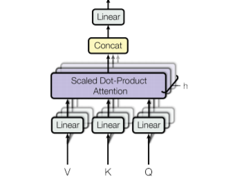

<div style="max-width: 820px; margin: 0 auto; padding: 24px 24px;">

#### Q1. What is tokenization, and why is it important in LLMs?
Tokenization is the process of splitting text into smaller units called **tokens**, which can be words, subwords, or even characters. This step is crucial because LLMs do not understand raw text directly — they process sequences of numbers representing these tokens.

Effective tokenization allows models to:
- Handle various languages and scripts
- Manage rare or out-of-vocabulary words
- Reduce vocabulary size, improving both efficiency and performance

---

#### Q2. What is LoRA and QLoRA?
LoRA and QLoRA are techniques designed to optimize the fine-tuning of Large Language Models (LLMs), focusing on reducing memory usage and enhancing efficiency without compromising performance in Natural Language Processing (NLP) tasks.

**LoRA** is a parameter-efficient fine-tuning method that introduces new trainable parameters to modify a model's behavior without increasing its overall size. By doing so, LoRA maintains the original parameter count, reducing the memory overhead typically associated with training large models. It works by adding low-rank matrix adaptations to the model's existing layers, allowing for significant performance improvements while keeping resource consumption in check.

**QLoRA** builds on LoRA by incorporating quantization to further optimize memory usage. It uses techniques such as 4-bit Normal Float, Double Quantization, and Paged Optimizers to compress the model's parameters and improve computational efficiency. This method is particularly useful when scaling large models, as it maintains performance levels comparable to full-precision models while significantly reducing resource consumption.

---

#### Q3. Explain the concept of temperature in LLM text generation.
Temperature is a hyperparameter that controls the randomness of text generation by adjusting the probability distribution over possible next tokens. 

A low temperature (close to 0) makes the model highly deterministic, favoring the most probable tokens. Conversely, a high temperature (above 1) encourages more diversity by flattening the distribution, allowing less probable tokens to be selected. For instance, a temperature of 0.7 strikes a balance between creativity and coherence, making it suitable for generating diverse but sensible outputs.

---

#### Q4. What is masked language modeling, and how does it contribute to model pretraining?

Masked language modeling (MLM) is a training objective where some tokens in the input are randomly masked, and the model is tasked with predicting them based on context. This forces the model to learn contextual relationships between words, enhancing its ability to understand language semantics. MLM is commonly used in models like BERT, which are pretrained using this objective to develop a deep understanding of language before fine-tuning on specific tasks.

| Pros                                   | Cons                          |
|-----------------------------------------|-------------------------------|
| Enhances contextual understanding      | Requires large amount of data |
| Improves language semantics            | Computationally expensive     |
| Pretraining for fine-tuning            | Potential for overfitting     |
| Widely used in BERT                    | Masking randomness           |

---

#### Q5. What are Sequence-to-Sequence Models?
Sequence-to-Sequence (Seq2Seq) Models are a type of neural network architecture designed to transform one sequence of data into another sequence. These models are commonly used in tasks where the input and output have variable lengths, such as in machine translation, text summarization, and speech recognition.

---

#### Q6. How do autoregressive models differ from masked models in LLM training?
Autoregressive models, such as GPT, generate text one token at a time, with each token predicted based on the previously generated tokens. This sequential approach is ideal for tasks like text generation. Masked models, like BERT, predict randomly masked tokens within a sentence, leveraging both left and right context. Autoregressive models excel in generative tasks, while masked models are better suited for understanding and classification tasks.

---
#### Q7. What role do embeddings play in LLMs, and how are they initialized?
Embeddings are vector representations of tokens that capture their semantic meaning. In LLMs, embeddings are used to convert tokens into continuous vectors that can be processed by the model. They are initialized using techniques like random initialization or pre-training on large corpora.

---

#### Q8. Explain the difference between top-k sampling and nucleus (top-p) sampling in LLMs.
Top-k token sampling: We sample the next token among the k tokens with the highest predicted probabilities.

Top-p sampling: We sample among top predicted words with an associated cumulative probability of at least p.

---

#### Q9. How does prompt engineering influence the output of LLMs?
Prompt engineering involves crafting input prompts to guide an LLM’s output effectively. Since LLMs are highly sensitive to input phrasing, a well-designed prompt can significantly influence the quality and relevance of the response. For example, adding context or specific instructions within the prompt can improve accuracy in tasks like summarization or question-answering. Prompt engineering is especially useful in zero-shot and few-shot learning scenarios, where task-specific examples are minimal.

---

#### Q10. What is model distillation, and how is it applied to LLMs?
Model distillation is a technique where a smaller, simpler model (student) is trained to replicate the behavior of a larger, more complex model (teacher). In the context of LLMs, the student model learns from the teacher’s soft predictions rather than hard labels, capturing nuanced knowledge. This approach reduces computational requirements and memory usage while maintaining similar performance, making it ideal for deploying LLMs on resource-constrained devices.

---

#### Q11. How do LLMs handle out-of-vocabulary (OOV) words?
Out-of-vocabulary words refer to words that the model did not encounter during training. LLMs address this issue through subword tokenization techniques like Byte-Pair Encoding (BPE) and WordPiece. These methods break down OOV words into smaller, known subword units. 

---

#### Q12. How does the Transformer architecture overcome the challenges faced by traditional Sequence-to-Sequence models?
The Transformer architecture overcomes key limitations of traditional Seq2Seq models in several ways:
- **Parallel Processing**: Seq2Seq models process sequentially, slowing training. Transformers use self-attention to process tokens in parallel, speeding up both training and inference.
- **Attention Mechanism**: Seq2Seq models struggle with long-range dependencies. Transformers use self-attention mechanisms to capture long-range dependencies, allowing them to process information across the entire input sequence.
- **Positional Encoding**: Since Transformers process the entire sequence at once, positional encoding is used to ensure the model understands token order.
- **Context Bottleneck**: Seq2Seq uses a single context vector, limiting information flow. Transformers let the decoder attend to all encoder outputs, improving context retention. 

---

#### Q13. What is overfitting in machine learning, and how can it be prevented?
Overfitting occurs when a machine learning model performs well on the training data but poorly on unseen or test data. This typically happens because the model has learned not only the underlying patterns in the data but also the noise and outliers, making it overly complex and tailored to the training set. As a result, the model fails to generalize to new data.

**Techniques to overcome overfitting:**
- **Regularization (L1, L2)**: Adding a penalty to the loss function to discourage overly complex models. L1 (Lasso) can help in feature selection, while L2 (Ridge) smooths weights.
- **Dropout**: In neural networks, dropout randomly deactivates a fraction of neurons during training, preventing the model from becoming overly reliant on specific nodes.
- **Data Augmentation**: Creating new training examples by applying transformations like rotations, translations, or scaling to the original data.
- **Early Stopping**: Monitoring the performance of the model on validation data and stopping training when the validation loss stops decreasing.
- **Simpler Models**: Reducing the complexity of the model by decreasing the number of features, parameters, or layers can help avoid overfitting.

---

#### Q14. What are positional encodings in the context of large language models?
Positional encodings are a technique used to add information about the position of tokens in a sequence to the input embeddings. This is important because the Transformer architecture does not inherently understand the order of tokens in a sequence, so positional encodings are used to provide this information.

Mechanism:
- Additive Approach: Positional encodings are added to input word embeddings, merging static word representations with positional data.
- Sinusoidal Function: Many LLMs, such as the GPT series, use sinusoidal functions to generate these positional encodings.
  
Formula:
```
PE(pos, 2i) = sin(pos / (10000^(2i/d_model)))
PE(pos, 2i+1) = cos(pos / (10000^(2i/d_model)))

Where:
- pos is the position in the sequence
- i is the dimension index (0 ≤ i < d_model/2)
- d_model is the dimensionality of the model
```

---

#### Q15. What is Multi-head attention?
Multi-head attention is an enhancement of single-head attention, allowing a model to attend to information from different representation subspaces simultaneously, focusing on various positions in the data. Instead of using a single attention mechanism, multi-head attention projects the queries, keys, and values into multiple subspaces (denoted as h times) through distinct learned linear transformations.


This process involves applying the attention function in parallel to each of these projected versions of the queries, keys, and values, which generates multiple output vectors. These outputs are then combined to produce the final dv-dimensional result. This approach improves the model's ability to capture more complex patterns and relationships in the data.

**Multi-head attention:**
$$
MultiHead(Q, K, V) = Concat(head_1, ..., head_h)W^O$$

Where:
- $head_i = Attention(QW^Q_i, KW^K_i, VW^V_i)$
- $W^Q_i, W^K_i, W^V_i$ are the learned linear transformations for the i-th head
- $W^O$ is the learned linear transformation for the output


#### Q16. Derive the softmax function and explain its role in attention mechanisms.
The softmax function transforms a vector of real numbers into a probability distribution. For an input vector $x = [x_1, x_2, ..., x_n]$, the softmax function for the i-th element is defined as:
$$
Softmax(x_i) = \frac{exp(x_i)}{\sum_{j=1}^{n} exp(x_j)}
$$

- This ensures all output values lie between 0 and 1 and sum to 1, making them interpretable as probabilities. 
- In attention mechanisms, softmax is applied to the attention scores to normalize them, allowing the model to assign varying levels of importance to different tokens when generating output. This helps the model focus on the most relevant parts of the input sequence.

---

#### Q17. How is the dot product used in self-attention, and what are its implications for computational efficiency?
In self-attention, the dot product is used to calculate the similarity between query (Q) and key (K) vectors. The attention scores are computed as:

The dot product is defined as:
$$
Attention(Q, K, V) = softmax(\frac{QK^T}{\sqrt{d_k}})V
$$

Where:
- Q is the query matrix
- K is the key matrix
- V is the value matrix
- d_k is the dimensionality of the key matrix

The dot product measures alignment between tokens, helping the model decide
which tokens to focus on. While effective, the complexity of the dot product
in sequence length ($O(n^2)$) can be a challenge for long sequences, prompting the development of more efficient approximations.

---

#### Q18. Explain cross-entropy loss and why it is commonly used in language modeling.
Cross-entropy loss measures the difference between the predicted probability distribution and the true distribution (one-hot encoding of the correct token). It is defined as:
$$
CrossEntropy(y, \hat{y}) = -\sum_{i=1}^{n} y_i \log(\hat{y_i})
$$
Where:
- y is the true distribution
- $\hat{y}$ is the predicted distribution
- n is the number of tokens

Cross-entropy loss penalizes incorrect predictions more heavily, encouraging the model to output probabilities that are closer to 1 for the correct class. In language modeling, it ensures the model predicts the correct token in a sequence with high confidence.

---

#### Q19. How do you compute the gradient of the loss function with respect to embeddings?
To compute the gradient of the loss $L$ with respect to an embedding vector $E$, you apply the chain rule:
$$
\frac{\partial L}{\partial E} = \frac{\partial L}{\partial \hat{y}} \frac{\partial \hat{y}}{\partial E} 
$$
Here, $\frac{\partial L}{\partial \hat{y}}$ is the gradient of the loss with respect to the output logits, and $\frac{\partial \hat{y}}{\partial E}$ is the gradient of the logits with respect to the embeddings.

Backpropagation propagates these gradients through the network layers, adjusting the embedding vectors to minimize the loss.

---


</div>